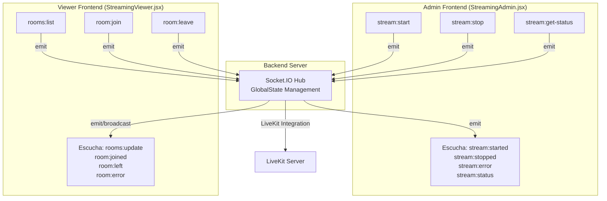
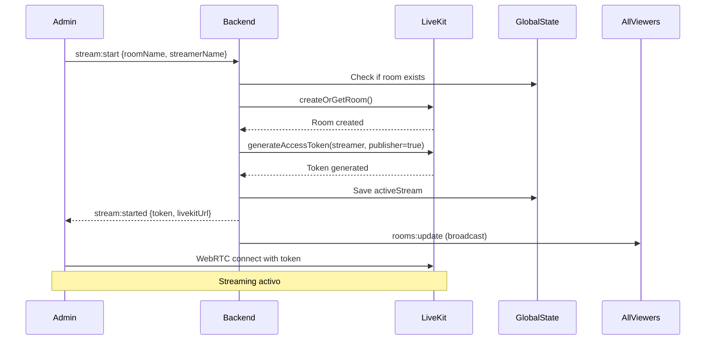
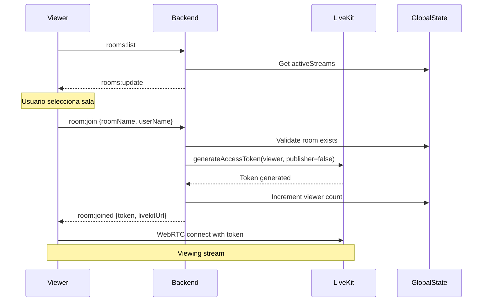
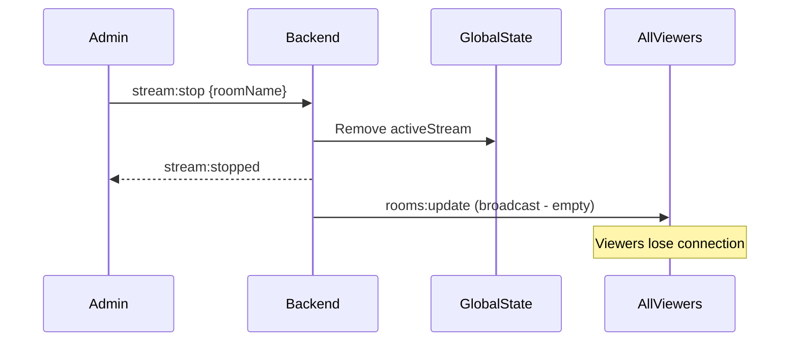

# 📡 Mapa de Comunicación Socket.IO - Sistema de Streaming

## 🏗️ Arquitectura de Eventos Socket.IO



## 📋 Eventos Socket.IO Implementados

### 🔴 **Eventos del Admin → Backend**

#### 1. `stream:start`
```javascript
// Admin → Backend: Iniciar streaming
socket.emit('stream:start', {
  roomName: string,     // Nombre de la sala
  streamerName: string  // ID del streamer
})
```
**Propósito**: Admin crea sala y comienza streaming  
**Respuesta**: `stream:started` o `stream:error`

#### 2. `stream:stop`
```javascript
// Admin → Backend: Detener streaming
socket.emit('stream:stop', {
  roomName: string,     // Nombre de la sala
  streamerName: string  // ID del streamer
})
```
**Propósito**: Admin detiene streaming  
**Respuesta**: `stream:stopped` o `stream:error`

#### 3. `stream:get-status`
```javascript
// Admin → Backend: Obtener estado actual
socket.emit('stream:get-status')
// Sin payload
```
**Propósito**: Verificar estado de sesiones previas  
**Respuesta**: `stream:status`

### 🔵 **Eventos del Viewer → Backend**

#### 1. `rooms:list`
```javascript
// Viewer → Backend: Solicitar lista de salas
socket.emit('rooms:list')
// Sin payload
```
**Propósito**: Obtener salas activas disponibles  
**Respuesta**: `rooms:update`

#### 2. `room:join`
```javascript
// Viewer → Backend: Unirse a sala
socket.emit('room:join', {
  roomName: string,  // Nombre de la sala
  userName: string   // ID del viewer
})
```
**Propósito**: Viewer se une como espectador  
**Respuesta**: `room:joined` o `room:error`

#### 3. `room:leave`
```javascript
// Viewer → Backend: Salir de sala
socket.emit('room:leave', {
  roomName: string,  // Nombre de la sala
  userName: string   // ID del viewer
})
```
**Propósito**: Viewer sale de la sala  
**Respuesta**: `room:left`

### 🟢 **Eventos del Backend → Frontends**

#### 1. `stream:started`
```javascript
// Backend → Admin: Streaming iniciado exitosamente
socket.emit('stream:started', {
  success: true,
  roomName: string,
  livekitToken: string,    // JWT token para LiveKit
  livekitUrl: string       // ws://IP:7880
})
```
**Trigger**: Respuesta a `stream:start` exitoso

#### 2. `stream:stopped`
```javascript
// Backend → Admin: Streaming detenido
socket.emit('stream:stopped', {
  success: true,
  roomName: string,
  message: string
})
```
**Trigger**: Respuesta a `stream:stop`

#### 3. `stream:error`
```javascript
// Backend → Admin: Error en operación
socket.emit('stream:error', {
  success: false,
  error: string,
  code: string,           // 'ROOM_EXISTS', 'NOT_FOUND', etc.
  details?: string
})
```
**Trigger**: Error en `stream:start`, `stream:stop`

#### 4. `stream:status`
```javascript
// Backend → Admin: Estado actual
socket.emit('stream:status', {
  isActive: boolean,
  roomName?: string,
  streamerName?: string,
  startedAt?: string,
  viewers: number,
  duration?: number
})
```
**Trigger**: Respuesta a `stream:get-status` o reconexión

#### 5. `rooms:update`
```javascript
// Backend → ALL Viewers (broadcast): Lista de salas
io.emit('rooms:update', {
  rooms: [{
    roomName: string,
    streamerName: string,
    startedAt: string,
    viewers: number,
    isActive: boolean
  }],
  total: number
})
```
**Trigger**: Cambios en salas (crear/eliminar), respuesta a `rooms:list`

#### 6. `room:joined`
```javascript
// Backend → Viewer: Unión exitosa
socket.emit('room:joined', {
  success: true,
  roomName: string,
  livekitToken: string,    // JWT token para LiveKit
  livekitUrl: string       // ws://IP:7880
})
```
**Trigger**: Respuesta a `room:join` exitoso

#### 7. `room:left`
```javascript
// Backend → Viewer: Salida exitosa
socket.emit('room:left', {
  success: true,
  roomName: string,
  message: string
})
```
**Trigger**: Respuesta a `room:leave`

#### 8. `room:error`
```javascript
// Backend → Viewer: Error en sala
socket.emit('room:error', {
  success: false,
  error: string,
  code: string
})
```
**Trigger**: Error en `room:join`, sala no existe o llena

---

## 🔄 Flujos de Comunicación Completos

### 🎥 **Flujo: Admin Inicia Streaming**


### 👁️ **Flujo: Viewer Ve Streaming**


### 🛑 **Flujo: Admin Detiene Streaming**


---

## 🚀 Estado Global del Backend

### GlobalState Structure
```javascript
const globalState = {
  // Map<roomName, streamData>
  activeStreams: new Map(),
  
  // Map<socketId, adminData>
  connectedAdmins: new Map(),
  
  // Map<socketId, viewerData>
  connectedViewers: new Map()
}
```

### StreamData Structure
```javascript
const streamData = {
  roomName: string,
  streamerName: string,
  streamerId: string,      // socket.id del admin
  startedAt: string,       // ISO timestamp
  viewers: number,         // contador actual
  isActive: boolean
}
```

---

## 🔧 Integración con LiveKit

### Tokens Generados
- **Admin (Publisher)**: `canPublish: true, canSubscribe: true`
- **Viewer (Subscriber)**: `canPublish: false, canSubscribe: true`

### Configuración LiveKit
```javascript
// constants.js
LIVEKIT: {
  HOST: process.env.LIVEKIT_HOST || 'ws://localhost:7880',
  API_KEY: 'devkey1000',
  SECRET: 'ultralowlatency2025secretkeyforlivekitsfuserver'
}
```

---

## ✅ Estado de Implementación

| Evento | Backend | Admin | Viewer | Estado |
|--------|---------|-------|---------|---------|
| `stream:start` | ✅ | ✅ | ❌ | Completo |
| `stream:stop` | ✅ | ✅ | ❌ | Completo |
| `stream:get-status` | ✅ | ✅ | ❌ | Completo |
| `rooms:list` | ✅ | ❌ | ✅ | Completo |
| `room:join` | ✅ | ❌ | ✅ | Completo |
| `room:leave` | ✅ | ❌ | ✅ | Completo |
| **Respuestas** | | | | |
| `stream:started/stopped/error` | ✅ | ✅ | ❌ | Completo |
| `rooms:update` | ✅ | ❌ | ✅ | Completo |
| `room:joined/left/error` | ✅ | ❌ | ✅ | Completo |

## 🚫 Eventos Eliminados (Limpieza)

Los siguientes eventos fueron **eliminados** por no utilizarse:
- ~~`livekit:getRooms`~~ → Reemplazado por `rooms:list`
- ~~`livekit:createRoom`~~ → Reemplazado por `stream:start`
- ~~`livekit:joinRoom`~~ → Reemplazado por `room:join`
- ~~`viewer:join/leave`~~ → Redundante con `room:join/leave`

---

## 🛠️ Mantenimiento

### Debug Socket.IO
```javascript
// En desarrollo, habilitar logs:
const io = require('socket.io')(server, {
  cors: SOCKET_CONFIG.cors,
  debug: process.env.NODE_ENV === 'development'
})
```

### Monitoreo de Conexiones
```javascript
// Verificar estado:
console.log('Active Streams:', globalState.activeStreams.size)
console.log('Connected Admins:', globalState.connectedAdmins.size)
console.log('Connected Viewers:', globalState.connectedViewers.size)
```